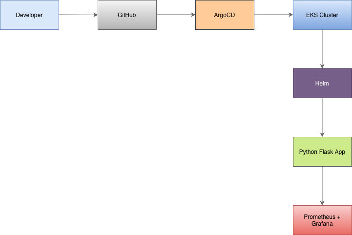
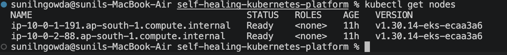
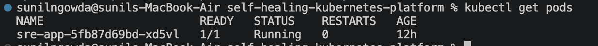
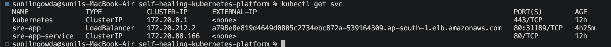
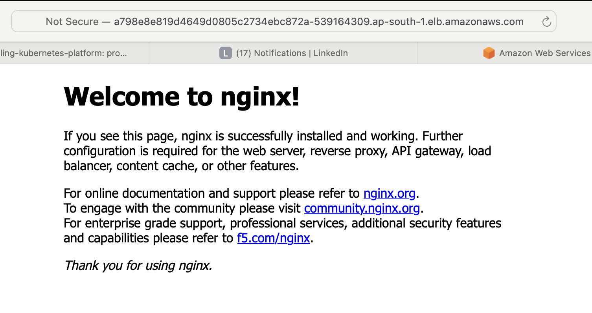

# Self-Healing Kubernetes Platform

Production-grade Kubernetes platform built using AWS EKS, Terraform, Helm, ArgoCD, Prometheus, and Grafana.

---

## Features

- AWS EKS cluster provisioning using Terraform
- ⁠Kubernetes application deployment using Helm
- ⁠GitOps workflow implementation using ArgoCD
- ⁠Monitoring setup with Prometheus and Grafana
- Self-healing Kubernetes probes
- LoadBalancer service exposure
- Infrastructure as code implementation
- Production-style Kubernetes architecture

---

## Tech Stack

- ⁠AWS EKS
- ⁠Terraform
- Kubernetes
- ⁠Helm
- ⁠ArgoCD
- ⁠Prometheus
- Grafana
- GitHub
- GitOps
- Infrastructure as Code (IaC)
- Devops Automation
- Python
- Nginx

## Setup Instructions

### Clone Repository

```bash
git clone <https://github.com/Akshitha315/self-healing-kubernetes-platform.git>
cd self-healing-kubernetes-platform
```

## Terraform Infrastructure Setup

```bash
cd terraform
terraform init
terraform apply
```
## Kubernetes Deployment

```bash
helm install sre-app ./helm/sre-app
```

##Verify Deployment

``` bash
kubectl get nodes
kubectl get pods
kubectl get svc
```

---

## Project Structure

```bash
terraform/
monitoring/
helm/
argocd/
automation/
app/
```
## Architecture



## Workflow

1. Terraform provisions AWS EKS infrastructure
2. Helm deploys Kubernetes application
3. ArgoCD manages GitOps deployment
4. Prometheus and Grafana handle monitoring
5. Kubernetes liveness and readiness probes ensure application health
6. Application is exposed using LoadBalancer service


## Screenshots

### Kubernetes Nodes


### Kubernetes pods


### Kubernetes Services


### Application Output


